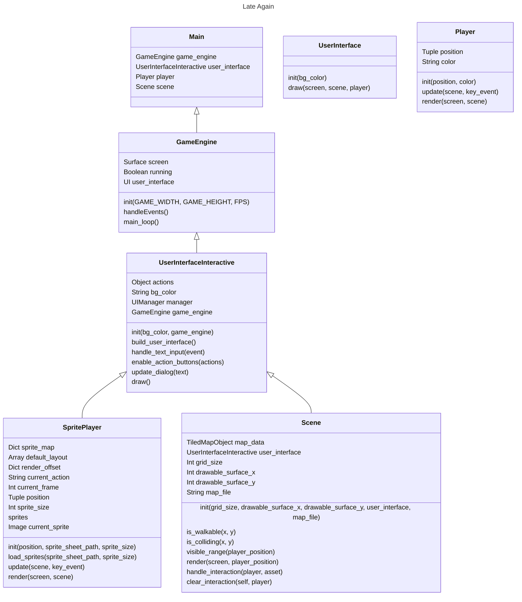

```mermaid
---
title: Late Again
---
classDiagram
    Main <|-- GameEngine
    GameEngine <|-- UserInterfaceInteractive
    UserInterfaceInteractive <|-- SpritePlayer
    UserInterfaceInteractive <|-- Scene
    Main : GameEngine game_engine
    Main : UserInterfaceInteractive user_interface
    Main: Player player
    Main: Scene scene
    class GameEngine{
        
        Surface screen
        Boolean running
        UI user_interface
        init(GAME_WIDTH, GAME_HEIGHT, FPS)
        handleEvents()
        main_loop()
    }
    class UserInterfaceInteractive{
        Object actions
        String bg_color
        UIManager manager
        GameEngine game_engine
        init(bg_color, game_engine)
        build_user_interface()
        handle_text_input(event)
        enable_action_buttons(actions)
        update_dialog(text)
        draw()
    }

    class Scene{
        TiledMapObject map_data
        UserInterfaceInteractive user_interface
        Int grid_size
        Int drawable_surface_x
        Int drawable_surface_y
        String map_file
        init(grid_size, drawable_surface_x, drawable_surface_y, user_interface, map_file)
        is_walkable(x, y)
        is_colliding(x, y)
        visible_range(player_position)
        render(screen, player_position)
        handle_interaction(player, asset)
        clear_interaction(self, player)
    }
    class SpritePlayer{
        Dict sprite_map
        Array default_layout
        Dict render_offset
        String current_action
        Int current_frame
        Tuple position
        Int sprite_size
        sprites
        Image current_sprite
        init(position, sprite_sheet_path, sprite_size)
        load_sprites(sprite_sheet_path, sprite_size)
        update(scene, key_event)
        render(screen, scene)
    }
    class UserInterface{
        init(bg_color)
        draw(screen, scene, player)
    }
    class Player{
        Tuple position
        String color
        init(position, color)
        update(scene, key_event)
        render(screen, scene)
    }
```