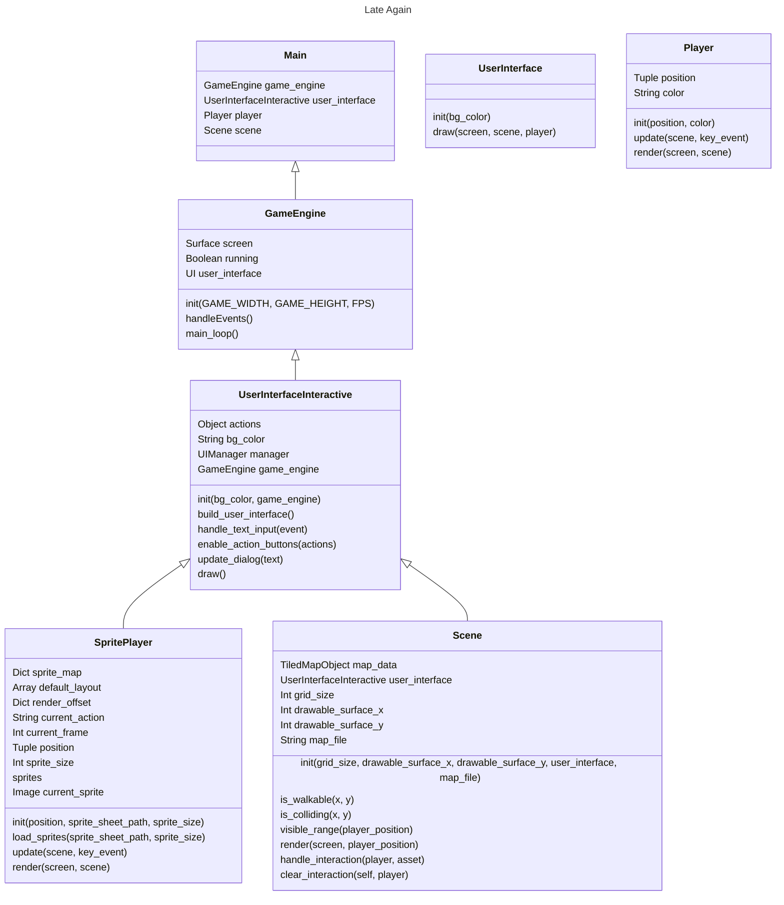

# A Video Games Jam Session

This repository contains the artifacts generated during our custom jam session on 04/02/2023.

## Goals

Given a basic description of a character and story background provided by a ChatGPT session, 
implement the stories, assets and code to provide a first prototype of a game.


## Requirements

> To be done

## Getting Started

### Game Architecture




#### How it works

##### Función Main (lanzamiento del juego)
La aplicación comienza la ejecución en la función `main()` donde se inicializan `game_engine`, `user_interface`, `player` y `scene` para luego asginar estos `user_interface`, `player` y `scene` al `main_loop`.

> `main_loop` es una propiedad que pertenece a `game_engine`, es el bucle de ejecución principal aka event loop

#### Game Engine
El game engine se inicializa pasando los parámetros `GAME_WIDTH`, `GAME_HEIGHT` y `FPS` a través del constructor, mientras que `screen` y `clock` se setean a la surface principal (`set_mode()`) y al reloj del juego directamente, las propiedades `running` y `user_interface` se setean a `false` y  `true`  respectivamente, `running` controla la salida del bucle para terminar la ejecución y `user_interface` se asignará más tarde a la correspondiente clase que maneje la interfaz.

Game Engine tiene disponibles 2 métodos `handle_events` y `main_loop`:
- `handle_events()` gestiona los eventos, por ahora no está abierto a ampliación.
- `main_loop(scene: "Scene", player: "SpritePlayer", user_interface: "UserInterfaceInteractive")` bucle de ejecución principal del juego, yendo a lo más básico este evento se debe encargar secuencialmente de recoger los eventos, actualizar los datos y renderizar el frame.
    ```python
    while self.running:
            self.clock.tick(self.fps)
            # Recoger eventos
            key_event = self.handle_events()

            # Actualizar datos
            scene.update(player, key_event)
            player.update(scene, key_event)

            # Renderizar frame
            user_interface.draw(self.screen, scene, player)
            pygame.display.flip()
    ```

##### UserInterfaceInteractive
Esta clase se encarga de:
- Establecer el color de fondo
- La creación, manejo de eventos de entrada y actualización de la interfaz usando `pygame_gui`
- Exponer el game engine para delegar el renderizado de `Player` y  `Scene` a esta clase, aunque sigue ejecutándose en `GameEngine` a través del método `draw()` de `UserInterfaceInteractive`.